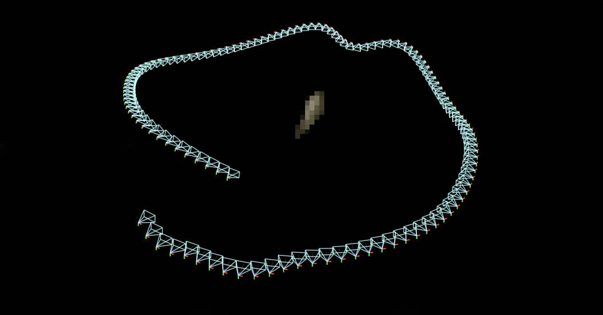
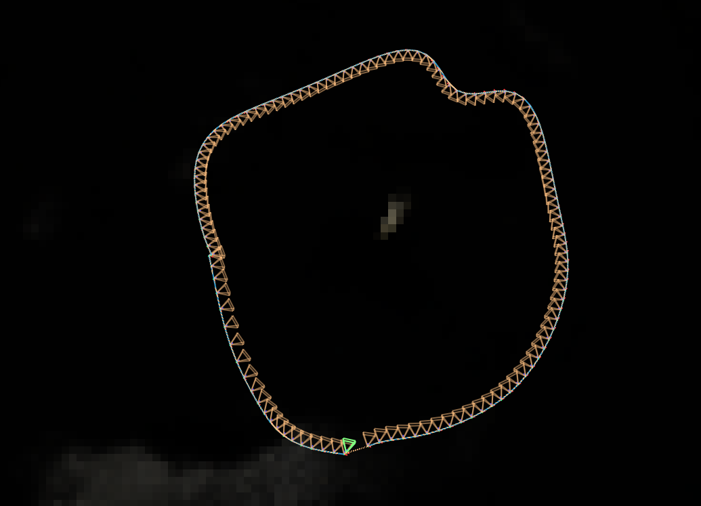
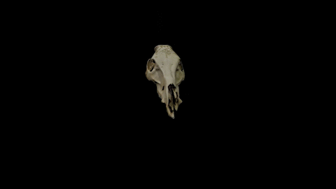
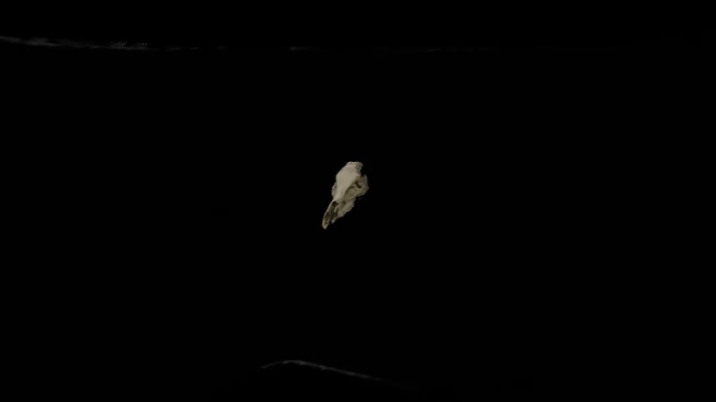
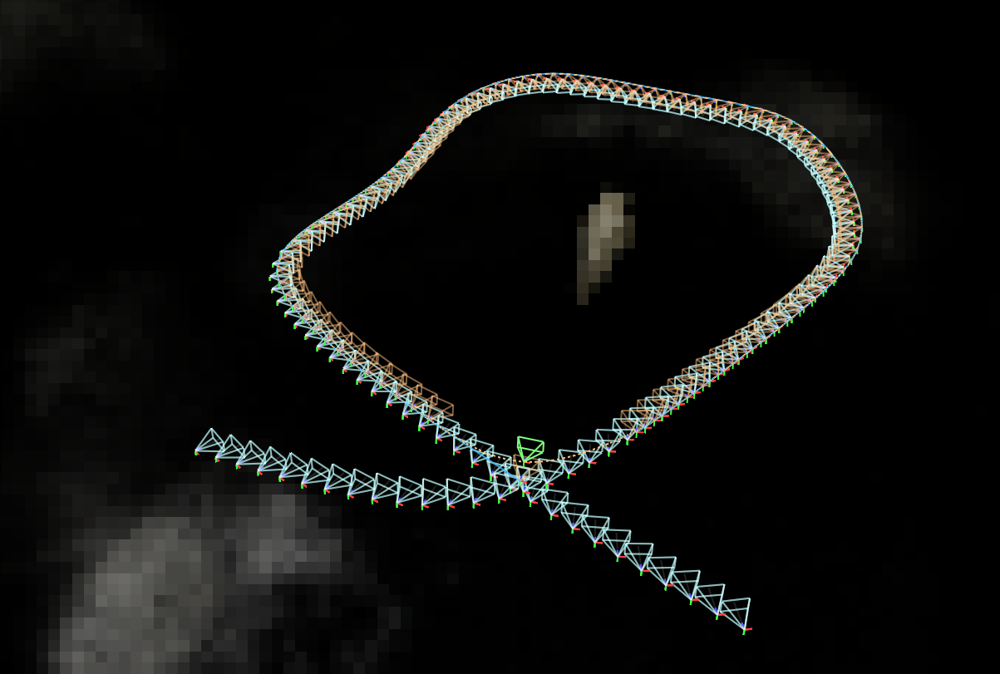
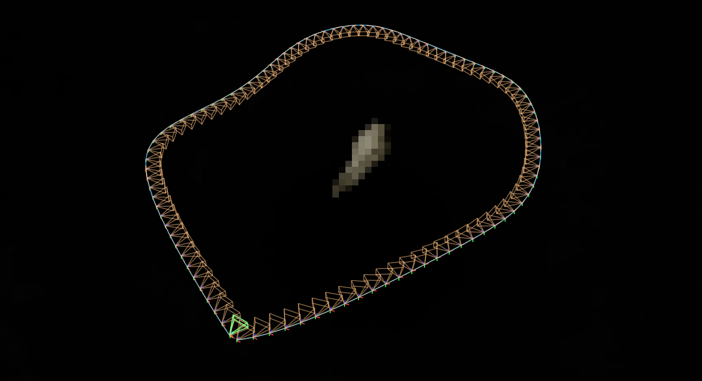
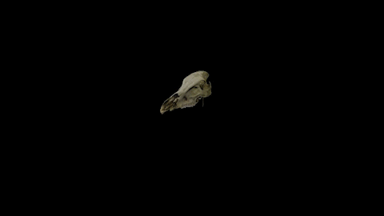
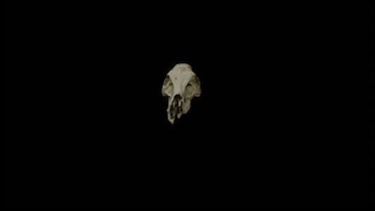

<h1> Creating Perfect Looping Gifs using NeRF </h1>

<h2> Problem </h2>

The challenge of achieving seamless and smooth loops in looping videos and GIFs is a common issue in digital media. This problem is rooted in several factors:

- <b>Visual Discontinuity:</b> 
When a video or GIF restarts, there's often a noticeable jump or glitch between the last and first frames, caused by variations in lighting and scene attributes.

- <b>Motion and Perspective Shifts:</b>
Dynamic scenes or camera pans can lead to inconsistencies in motion and perspective disrupting the intended flow of the loop.

- <b>Temporal Misalignment:</b> 
Even slight timing differences between the end and start frames can result in disruptive visual transitions.

In this project, I will address those problems and provide a practical and effective solution.

<h2> Solution </h2>

My approach uses Nvidia's Instant-NGP and Neural Networks to produce perfect-looping renderes.

1. <b>Rendering the NeRF:</b> I used Nvidia's Instant NGP to render the nerf using the original video.

2. <b>Crossing Point Detection:</b> If a crossing point in the path is detected, the path is segmented, and a new path is synthesized using the existing trajectory, starting from the crossing point.

3. <b>Image-Based Path Segmentation:</b> If there is no crossing point in the path, n instances where no crossing points exist, the two most similar images from the video's start and end are identified. The path is then cropped around those points.

4. <b>Path Generation with LSTM:</b> In the case of cropped ends to the path, we employ an LSTM network trained on the rest of the path to generate a seamless connection between the endpoint remnants. This LSTM implementation serves to preserve the inherent flow of the path while effectively bridging any discontinuities that may have arisen due to cropping.

<h4>Extra Feature:</h4>
Using this approach can also serve as a good shaking stabilization for videos. The interpolation between camera frames in the path results in a smooth video render of the scene using the original camera frames.

<h2>Examples:</h2>

<h2> Synthetics Data:</h2>
<h3> Skull Disconnected:</h3>

<table>
  <thead>
    <tr>
      <th></th>
      <th>Original</th>
      <th>Generated</th>
    </tr>
  </thead>
  <tbody>
    <tr>
      <td>Path</td>
      <td></td>
      <td></td>
    </tr>
    <tr>
      <td>GIF</td>
      <td></td>
      <td></td>
    </tr>
  </tbody>
</table>

<h3> Skull Tie:</h3>

<table>
  <thead>
    <tr>
      <th></th>
      <th>Original</th>
      <th>Generated</th>
    </tr>
  </thead>
  <tbody>
    <tr>
      <td>Path</td>
      <td></td>
      <td></td>
    </tr>
    <tr>
      <td>GIF</td>
      <td></td>
      <td></td>
    </tr>
  </tbody>
</table>

<h2>Real Data </h2>
<h3> Books:</h3>

<table>
  <thead>
    <tr>
      <th></th>
      <th>Original</th>
      <th>Generated</th>
    </tr>
  </thead>
  <tbody>
    <tr>
      <td>Path</td>
      <td></td>
      <td></td>
    </tr>
    <tr>
      <td>GIF</td>
      <td></td>
      <td></td>
    </tr>
  </tbody>
</table>

<h2> Limitations </h2>

- <b>Original Data Prerequisites:</b> 
    
    1. Our approach assumes that the data inherently possesses a crossing point or that it commences and concludes with a comparable frame structure. This similarity ensures that the viewpoint captures similar scenes, forming the foundation for our methodology.

    2. We also assume that the scene is static (doesn't have moving objects).

<h2> Refrences </h2>

1. <b>[Nvidia's Instant-NGP](https://github.com/NVlabs/instant-ngp/)</b>
2. <b>[Data Preparation for NeRF](https://github.com/NVlabs/instant-ngp/blob/master/docs/nerf_dataset_tips.md#colmap)</b>