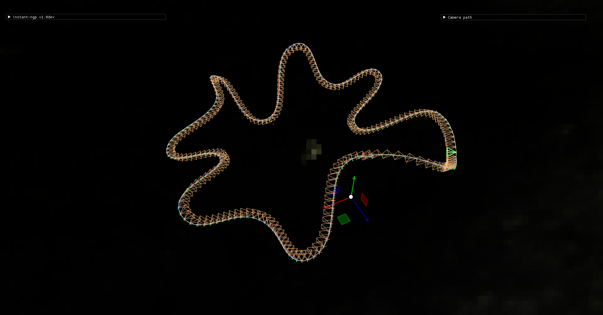
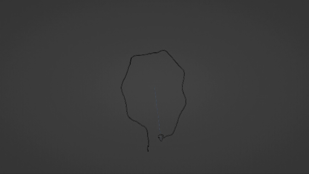
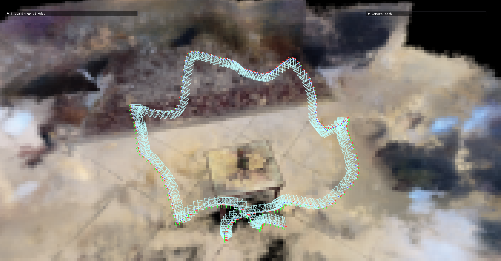
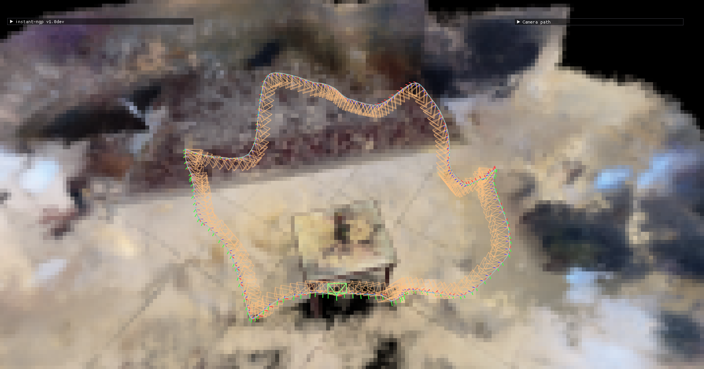

<h1> Creating Perfect Looping Gifs using NeRF </h1>

<h2> Problem </h2>

The challenge of achieving seamless and smooth loops in looping videos and GIFs is a common issue in digital media. This problem is rooted in several factors:

- <b>Visual Discontinuity:</b> 
When a video or GIF restarts, there's often a noticeable jump or glitch between the last and first frames, caused by variations in lighting and scene attributes.

- <b>Motion and Perspective Shifts:</b>
Dynamic scenes or camera pans can lead to inconsistencies in motion and perspective disrupting the intended flow of the loop.

- <b>Temporal Misalignment:</b> 
Even slight timing differences between the end and start frames can result in disruptive visual transitions.

<h2> Solution </h2>

My approach uses Nvidia's Instant-NGP and Neural Networks to produce perfect-looping renders.

1. <b>Rendering the NeRF:</b> I used Nvidia's Instant NGP to render the nerf using the original video.

2. <b>Finding Interest Point:</b>
    - <b>Crossing Point Detection:</b> This method becomes applicable when during filming, our path intersects itself at certain instances. In such cases, we identify pairs of frames that are in close proximity (within a specified threshold) at the point of intersection. By selecting these frames, we exclude the surplus segments of the path. This allows us to establish a segment centered around the intersection point. The algorithm for this works as follows:
    
      1. <b>Trajectory Analysis:</b> Analyze the camera trajectory to find points where it comes close to crossing its own path. This is achieved by evaluating the positional data at each frame.

      2. <b>Crossing Point Estimation:</b> Once potential crossing points are identified, a threshold value (a minimal distance or angular difference) is defined to determine how close the paths are to a "true crossing". This threshold can be adjusted based on the specific requirements of the loop.

      3. <b>Cropping the path:</b> After choosing the closest frames to be crossing, we crop the path around them with a set size.

      - Example (Skull Tie at crossing point):
          <table>
          <thead>
          <tr>
            <th>Path</th>
            <th>First Point #10/120</th>
            <th>Second Point #106/120 </th>
          </tr>
          </thead>
          <tbody>
            <tr>
              <td></td>
              <td></td>
              <td></td>
            </tr>
          </tbody>
          </table>

    - <b>Image-Based Path Segmentation:</b> This method comes into play when no significant crossing points are found. The focus here is to find two frames with similar visual content and poses, which would act as the start and end points for the new connecting path. The algorithm for this would be:

      1. <b>Frame Similarity Analysis:</b> Analyze the visual content or poses in each frame, comparing them using similarity metrics, in our case we used ORB matching to identify the most similar frames throughout the video.
      
      2. <b>Cropping the path:</b> After choosing the most similar frames, we crop the path around them with a set size.

      - Example (Skull):
          <table>
          <thead>
          <tr>
            <th>First Point #2/120</th>
            <th>Second Point #120/120 </th>
          </tr>
          </thead>
          <tbody>
            <tr>
              <td></td>
              <td></td>
            </tr>
          </tbody>
          </table>

3. <b>Selection of Start and End Points:</b> Whether through "Crossing Point Detection" or "Image-Based Path Segmentation", our approach remains consistent. We identify a segment of the path surrounding these frames (either crossing frames, or most similar frames) and crop it by a predetermined value to determine our new start and end points, thus facilitating an area to generate the looping path.

4. <b>Path Generation with LSTM:</b> After identifying the key interest points and cropping the ends of the path, we employ an LSTM network trained on the rest of the path to generate a seamless connection between the endpoint remnants. We generate points in a linear line interpolating between the two ends. For each point along this linear path, we predict its correct position using the network and apply the change while maintaining the distance and continuity that the linear interpolation provides. In addition, This implementation serves to preserve the inherent flow of the path while effectively bridging any discontinuities that may have arisen due to cropping.

<h4>Extra Feature:</h4>
Using this approach can also serve as a good shaking stabilization for videos. The interpolation between camera frames in the path results in a smooth video render of the scene using the original camera frames.

<h2> Limitations </h2>

- <b>Original Data Prerequisites:</b> 
    
    1. Our approach assumes that the data inherently possesses a crossing point or that it commences and concludes with a comparable frame structure. This similarity ensures that the viewpoint captures similar scenes, forming the foundation for our methodology.

    2. We also assume that the scene is static (doesn't have moving objects).

- <b>Dependency on Instant-NGP:</b> </br>
  Nvidia's Instant-NGP offers a streamlined process to train the nerf, generate a camera path, and render the video. However, this also ties us to its limitations. Though many of its outputs are commendable, some fall short, as evidenced by the 'avocado' render below. Despite a well generated camera path, constraints in the data can lead to flawed nerf generation from specific angles.

<h2>Usage:</h2>

```shell
python create_camera_path.py --data [DATA_DIR] --output_dir [OUTPUT_DIR] [--duration DURATION] [--smoothness SMOOTHNESS] [--fps FPS]
```

<h3>Arguments:</h3>

```--data ```: (Required) Path to the directory containing the image and transformation data. The directory should have an 'images' sub-directory containing all the images and a 'transforms.json' generated from running COLMAP (see data preperation below).

```--output_dir```: (Required) Directory where the generated camera path JSON files ('camera_path.json' and 'full_camera_path.json') will be saved.

```--duration```: (Optional) The total duration of the camera path in seconds. Default is 10 seconds.

```--smoothness```: (Optional) A factor that influences the smoothness of the camera path. The higher the value, the smoother the path. Default is 0.

```--fps```: (Optional) Frames per second for the camera path. Default is 24 FPS.

---

<h2>Results:</h2>

* The red segment in the 'Path GIF' is the generated path.

<h2> Synthetics Data:</h2>
<h3> Skull Disconnected:</h3>

<table>
  <thead>
    <tr>
      <th></th>
      <th>Original</th>
      <th>Generated</th>
    </tr>
  </thead>
  <tbody>
    <tr>
      <td>Path</td>
      <td></td>
      <td></td>
    </tr>
    <tr>
      <td>Path GIF</td>
      <td></td>
      <td></td>
    </tr>
    <tr>
      <td>Rendered GIF</td>
      <td></td>
      <td></td>
    </tr>
  </tbody>
</table>

<h3> Skull Tie:</h3>

<table>
  <thead>
    <tr>
      <th></th>
      <th>Original</th>
      <th>Generated</th>
    </tr>
  </thead>
  <tbody>
    <tr>
      <td>Path</td>
      <td></td>
      <td></td>
    </tr>
    <tr>
      <td>Path GIF</td>
      <td></td>
      <td></td>
    </tr>
    <tr>
      <td>Rendered GIF</td>
      <td></td>
      <td></td>
    </tr>
  </tbody>
</table>

<h3> Avocado:</h3>

<table>
  <thead>
    <tr>
      <th></th>
      <th>Original</th>
      <th>Generated</th>
    </tr>
  </thead>
  <tbody>
    <tr>
      <td>Path</td>
      <td></td>
      <td></td>
    </tr>
    <tr>
      <td>Path GIF</td>
      <td></td>
      <td></td>
    </tr>
    <tr>
      <td>Rendered GIF</td>
      <td></td>
      <td></td>
    </tr>
  </tbody>
</table>

<h2>Real Data </h2>
<h3> Books:</h3>

<table>
  <thead>
    <tr>
      <th></th>
      <th>Original</th>
      <th>Generated</th>
    </tr>
  </thead>
  <tbody>
    <tr>
      <td>Path</td>
      <td></td>
      <td></td>
    </tr>
    <tr>
      <td>Path GIF</td>
      <td></td>
      <td></td>
    </tr>
    <tr>
      <td>Rendered GIF</td>
      <td></td>
      <td></td>
    </tr>
  </tbody>
</table>

<h3> Doll:</h3>

<table>
  <thead>
    <tr>
      <th></th>
      <th>Original</th>
      <th>Generated</th>
    </tr>
  </thead>
  <tbody>
    <tr>
      <td>Path</td>
      <td></td>
      <td></td>
    </tr>
    <tr>
      <td>Path GIF</td>
      <td></td>
      <td></td>
    </tr>
    <tr>
      <td>Rendered GIF</td>
      <td></td>
      <td></td>
    </tr>
  </tbody>
</table>

<h3> Controller:</h3>

<table>
  <thead>
    <tr>
      <th></th>
      <th>Original</th>
      <th>Generated</th>
    </tr>
  </thead>
  <tbody>
    <tr>
      <td>Path</td>
      <td></td>
      <td></td>
    </tr>
    <tr>
      <td>Path GIF</td>
      <td></td>
      <td></td>
    </tr>
    <tr>
      <td>Rendered GIF</td>
      <td></td>
      <td></td>
    </tr>
  </tbody>
</table>

<h2> Refrences </h2>

1. <b>[Nvidia's Instant-NGP](https://github.com/NVlabs/instant-ngp/)</b>
2. <b>[Data Preparation for NeRF](https://github.com/NVlabs/instant-ngp/blob/master/docs/nerf_dataset_tips.md#colmap)</b>
3. <b>[Skull Model](https://www.blenderboom.com/product/deer-skull-1/)</b>
4. <b>[Avocado Model](https://www.blenderboom.com/product/avocado_fruit/)</b>

* Synthetic data was created in blender.
* Real data was shot on an iphone X.
